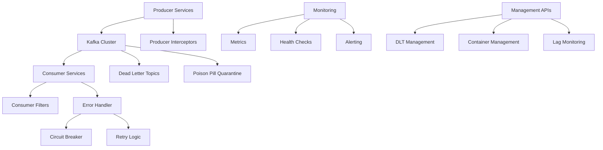

# Spring Kafka Pro - Developer Reference Guide

## 📚 Table of Contents

- [Introduction](#introduction)
- [Architecture Overview](#architecture-overview)
- [Core Features](#core-features)
- [Configuration Guide](#configuration-guide)
- [Implementation Patterns](#implementation-patterns)
- [Advanced Features](#advanced-features)
- [Error Handling](#error-handling)
- [Monitoring & Observability](#monitoring--observability)
- [Security Implementation](#security-implementation)
- [Testing Strategies](#testing-strategies)
- [Performance Optimization](#performance-optimization)
- [Production Deployment](#production-deployment)
- [Code Examples](#code-examples)
- [Best Practices](#best-practices)
- [Troubleshooting](#troubleshooting)

---

## Introduction

Spring Kafka Pro is a comprehensive, production-ready Spring Boot application that demonstrates advanced Apache Kafka integration patterns. This guide serves as a complete reference for developers looking to build robust, scalable Kafka-based applications.

### What You'll Learn

✅ Production-ready Kafka configuration patterns  
✅ Advanced error handling and recovery strategies  
✅ Comprehensive monitoring and observability  
✅ Security implementation with SSL/TLS and SASL  
✅ Performance optimization techniques  
✅ Testing strategies with TestContainers  
✅ Deployment and operational best practices  

### Key Benefits

- **Production-Ready**: Battle-tested configurations and patterns
- **Comprehensive**: Covers all aspects of Kafka integration
- **Extensible**: Modular design for easy customization
- **Well-Tested**: Extensive test coverage with real scenarios
- **Observable**: Built-in monitoring and alerting
- **Secure**: Security-first approach with encryption and authentication

---

## Architecture Overview

### High-Level Architecture



### Component Breakdown

| Component | Purpose | Key Features |
|-----------|---------|--------------|
| **Producer Services** | Message publishing | Idempotence, batching, compression |
| **Consumer Services** | Message processing | Manual ack, concurrency, filtering |
| **Error Handler** | Failure management | Poison pill detection, circuit breaker |
| **DLT Manager** | Failed message handling | Reprocessing, analytics, retention |
| **Monitoring** | Observability | Metrics, health checks, lag tracking |
| **Security** | Data protection | SSL/TLS, SASL, validation |

---

## Core Features

### 1. Enhanced Kafka Configuration

**Location**: `src/main/java/com/company/kafka/config/KafkaConfiguration.java`

#### Producer Configuration
```java
@Bean
public ProducerFactory<String, Object> producerFactory() {
    Map<String, Object> props = new HashMap<>();
    
    // Reliability settings
    props.put(ProducerConfig.ACKS_CONFIG, "all");                    // Wait for all replicas
    props.put(ProducerConfig.RETRIES_CONFIG, Integer.MAX_VALUE);     // Infinite retries
    props.put(ProducerConfig.ENABLE_IDEMPOTENCE_CONFIG, true);       // Prevent duplicates
    props.put(ProducerConfig.MAX_IN_FLIGHT_REQUESTS_PER_CONNECTION, 1); // Maintain ordering
    
    // Performance optimization
    props.put(ProducerConfig.BATCH_SIZE_CONFIG, 32768);              // 32KB batches
    props.put(ProducerConfig.LINGER_MS_CONFIG, 20);                  // Wait 20ms for batching
    props.put(ProducerConfig.COMPRESSION_TYPE_CONFIG, "snappy");     // Enable compression
    props.put(ProducerConfig.BUFFER_MEMORY_CONFIG, 67108864);        // 64MB buffer
    
    // Transaction settings for exactly-once semantics
    props.put(ProducerConfig.TRANSACTIONAL_ID_CONFIG, "kafka-producer-tx");
    props.put(ProducerConfig.TRANSACTION_TIMEOUT_CONFIG, 30000);
    
    return new DefaultKafkaProducerFactory<>(props);
}
```

#### Consumer Configuration
```java
@Bean
public ConsumerFactory<String, Object> consumerFactory() {
    Map<String, Object> props = new HashMap<>();
    
    // Basic configuration
    props.put(ConsumerConfig.BOOTSTRAP_SERVERS_CONFIG, kafkaProperties.bootstrapServers());
    props.put(ConsumerConfig.KEY_DESERIALIZER_CLASS_CONFIG, StringDeserializer.class);
    props.put(ConsumerConfig.VALUE_DESERIALIZER_CLASS_CONFIG, JsonDeserializer.class);
    
    // Consumer group and offset management
    props.put(ConsumerConfig.GROUP_ID_CONFIG, consumer.groupId());
    props.put(ConsumerConfig.AUTO_OFFSET_RESET_CONFIG, "earliest");
    props.put(ConsumerConfig.ENABLE_AUTO_COMMIT_CONFIG, false);      // Manual acknowledgment
    
    // Performance settings
    props.put(ConsumerConfig.MAX_POLL_RECORDS_CONFIG, 500);
    props.put(ConsumerConfig.MAX_POLL_INTERVAL_MS_CONFIG, 300000);   // 5 minutes
    props.put(ConsumerConfig.SESSION_TIMEOUT_MS_CONFIG, 30000);      // 30 seconds
    props.put(ConsumerConfig.HEARTBEAT_INTERVAL_MS_CONFIG, 10000);   // 10 seconds
    
    // Isolation level for transactional reads
    props.put(ConsumerConfig.ISOLATION_LEVEL_CONFIG, "read_committed");
    
    return new DefaultKafkaConsumerFactory<>(props);
}
```

### 2. Transactional Processing

**Location**: `src/main/java/com/company/kafka/service/TransactionalKafkaService.java`

#### Exactly-Once Semantics
```java
@Service
@Transactional("kafkaTransactionManager")
public class TransactionalKafkaService {

    @Transactional("kafkaTransactionManager")
    public void processOrderTransaction(OrderEvent orderEvent, PaymentEvent paymentEvent) {
        try {
            // Process order
            kafkaTemplate.send("orders-topic", orderEvent.getOrderId(), orderEvent);
            
            // Process payment
            kafkaTemplate.send("payments-topic", paymentEvent.getPaymentId(), paymentEvent);
            
            // Update inventory
            kafkaTemplate.send("inventory-topic", orderEvent.getOrderId(), 
                createInventoryUpdate(orderEvent));
            
            log.info("Order transaction completed successfully: {}", orderEvent.getOrderId());
            
        } catch (Exception e) {
            log.error("Order transaction failed: {}", orderEvent.getOrderId(), e);
            throw new RecoverableException("Order transaction failed", e);
        }
    }
}
```

### 3. Batch Processing

**Location**: `src/main/java/com/company/kafka/service/BatchKafkaConsumerService.java`

#### High-Throughput Batch Consumer
```java
@Service
@Slf4j
public class BatchKafkaConsumerService {

    @KafkaListener(
        topics = "${kafka.topics.orders.name}",
        batch = "true",
        containerFactory = "batchKafkaListenerContainerFactory"
    )
    public void consumeOrderEventsBatch(List<ConsumerRecord<String, Object>> records,
                                       Acknowledgment acknowledgment) {
        
        log.info("Processing batch of {} order events", records.size());
        
        List<Object> successfulRecords = new ArrayList<>();
        List<ConsumerRecord<String, Object>> failedRecords = new ArrayList<>();
        
        for (ConsumerRecord<String, Object> record : records) {
            try {
                Object orderEvent = record.value();
                
                // Validate order
                validateOrderEvent(orderEvent);
                
                // Process order
                processOrder(orderEvent);
                
                successfulRecords.add(orderEvent);
                
            } catch (ValidationException e) {
                log.error("Validation failed for order: {}", record.key(), e);
                failedRecords.add(record);
                
            } catch (Exception e) {
                log.error("Processing failed for order: {}", record.key(), e);
                failedRecords.add(record);
            }
        }
        
        // Acknowledge successful records
        if (!successfulRecords.isEmpty()) {
            acknowledgment.acknowledge();
            log.info("Acknowledged {} successful records", successfulRecords.size());
        }
        
        // Handle failed records
        if (!failedRecords.isEmpty()) {
            handleFailedBatchRecords(failedRecords);
        }
    }
}
```

### 4. Message Filtering

**Location**: `src/main/java/com/company/kafka/filter/KafkaRecordFilters.java`

#### Intelligent Message Filtering
```java
@Component
public class KafkaRecordFilters {

    public Predicate<ConsumerRecord<String, Object>> testMessageFilter() {
        return record -> {
            String messageType = getHeaderValue(record, "message-type");
            return !"test".equals(messageType);
        };
    }

    public Predicate<ConsumerRecord<String, Object>> businessRuleFilter() {
        return record -> {
            try {
                Object value = record.value();
                
                // Filter based on business rules
                if (value instanceof Map) {
                    Map<String, Object> data = (Map<String, Object>) value;
                    Object status = data.get("status");
                    
                    // Only process active records
                    return "ACTIVE".equals(status);
                }
                
                return true;
                
            } catch (Exception e) {
                log.warn("Filter evaluation failed for record: {}", record.key(), e);
                return false;
            }
        };
    }
}
```

### 5. Producer Interceptors

**Location**: `src/main/java/com/company/kafka/interceptor/KafkaProducerInterceptor.java`

#### Message Enrichment
```java
public class KafkaProducerInterceptor implements ProducerInterceptor<String, Object> {

    @Override
    public ProducerRecord<String, Object> onSend(ProducerRecord<String, Object> record) {
        
        // Add correlation ID
        String correlationId = UUID.randomUUID().toString();
        record.headers().add("correlation-id", correlationId.getBytes(StandardCharsets.UTF_8));
        
        // Add timestamp
        record.headers().add("producer-timestamp", 
            Instant.now().toString().getBytes(StandardCharsets.UTF_8));
        
        // Add application metadata
        record.headers().add("application-name", 
            applicationName.getBytes(StandardCharsets.UTF_8));
        record.headers().add("application-version", 
            applicationVersion.getBytes(StandardCharsets.UTF_8));
        
        // Add environment info
        record.headers().add("environment", 
            environment.getBytes(StandardCharsets.UTF_8));
        
        log.debug("Enriched message with correlation ID: {} for topic: {}", 
            correlationId, record.topic());
        
        return record;
    }
}
```

---

## Advanced Features

### 1. Enhanced Error Handling

**Location**: `src/main/java/com/company/kafka/error/EnhancedKafkaErrorHandler.java`

#### Poison Pill Detection
```java
public class EnhancedKafkaErrorHandler {

    private boolean isPoisonPill(String messageKey) {
        AtomicInteger failureCount = messageFailureCounts.get(messageKey);
        if (failureCount == null) {
            return false;
        }
        
        // Check if we've exceeded the threshold
        if (failureCount.get() >= poisonPillThreshold) {
            Long lastFailure = lastFailureTime.get(messageKey);
            if (lastFailure != null) {
                // Check if still within cooldown period
                return (System.currentTimeMillis() - lastFailure) < poisonPillCooldownMs;
            }
        }
        
        return false;
    }

    private void sendToPoisonPillTopic(ConsumerRecord<?, ?> record, Exception exception) {
        try {
            String poisonTopic = record.topic() + ".poison-pill.quarantine";
            
            // Create poison pill analysis record
            Map<String, Object> analysisData = Map.of(
                "originalTopic", record.topic(),
                "originalPartition", record.partition(),
                "originalOffset", record.offset(),
                "failureCount", getFailureCount(generateMessageKey(record)),
                "firstFailureTime", getFirstFailureTime(generateMessageKey(record)),
                "lastFailureTime", System.currentTimeMillis(),
                "exceptionType", exception.getClass().getName(),
                "exceptionMessage", exception.getMessage(),
                "hostname", getHostname(),
                "environment", getEnvironment()
            );
            
            kafkaTemplate.send(poisonTopic, record.key() != null ? record.key().toString() : null, analysisData);
            
            log.error("Poison pill quarantined - topic: {}, analysis sent to: {}", record.topic(), poisonTopic);
            
        } catch (Exception e) {
            log.error("Failed to send poison pill to quarantine topic", e);
        }
    }
}
```

#### Circuit Breaker Pattern
```java
private void updateCircuitBreaker(String serviceName, boolean success) {
    CircuitBreakerState state = circuitBreakers.computeIfAbsent(serviceName, 
        k -> new CircuitBreakerState());
    
    if (success) {
        // Reset on success
        state.failureCount.set(0);
        state.lastSuccessTime = System.currentTimeMillis();
        if (state.state == CircuitBreakerState.State.HALF_OPEN) {
            state.state = CircuitBreakerState.State.CLOSED;
            log.info("Circuit breaker CLOSED for service: {}", serviceName);
        }
    } else {
        // Increment failure count
        int failures = state.failureCount.incrementAndGet();
        state.lastFailureTime = System.currentTimeMillis();
        
        if (failures >= circuitBreakerFailureThreshold && 
            state.state == CircuitBreakerState.State.CLOSED) {
            
            state.state = CircuitBreakerState.State.OPEN;
            circuitBreakerOpenCounter.increment();
            log.error("Circuit breaker OPENED for service: {} after {} failures", serviceName, failures);
        }
    }
    
    // Check if we should transition to half-open
    if (state.state == CircuitBreakerState.State.OPEN &&
        (System.currentTimeMillis() - state.lastFailureTime) > circuitBreakerTimeoutMs) {
        
        state.state = CircuitBreakerState.State.HALF_OPEN;
        log.info("Circuit breaker HALF-OPEN for service: {}", serviceName);
    }
}
```

### 2. Dead Letter Topic Management

**Location**: `src/main/java/com/company/kafka/dlt/DeadLetterTopicManager.java`

#### DLT Reprocessing
```java
public DltReprocessingResult reprocessMessages(String dltTopicName, int maxMessages, 
                                             MessageFilter messageFilter) {
    log.info("Starting DLT reprocessing - topic: {}, maxMessages: {}", dltTopicName, maxMessages);
    
    String originalTopic = extractOriginalTopicName(dltTopicName);
    if (originalTopic == null) {
        return new DltReprocessingResult(0, 0, "Invalid DLT topic name: " + dltTopicName);
    }
    
    int processed = 0;
    int skipped = 0;
    int errors = 0;
    
    try (Consumer<String, Object> consumer = consumerFactory.createConsumer("dlt-reprocessor", "reprocessor")) {
        // Subscribe to DLT topic
        List<TopicPartition> partitions = getTopicPartitions(dltTopicName);
        consumer.assign(partitions);
        consumer.seekToBeginning(partitions);
        
        boolean continueProcessing = true;
        int batchCount = 0;
        
        while (continueProcessing && (maxMessages == 0 || processed < maxMessages)) {
            ConsumerRecords<String, Object> records = consumer.poll(Duration.ofSeconds(5));
            
            if (records.isEmpty()) {
                log.debug("No more messages in DLT topic: {}", dltTopicName);
                break;
            }
            
            for (ConsumerRecord<String, Object> record : records) {
                if (maxMessages > 0 && processed >= maxMessages) {
                    continueProcessing = false;
                    break;
                }
                
                try {
                    // Apply message filter if provided
                    if (messageFilter != null && !messageFilter.shouldReprocess(record)) {
                        skipped++;
                        continue;
                    }
                    
                    // Validate message before reprocessing
                    if (!isMessageValidForReprocessing(record)) {
                        log.warn("Message not valid for reprocessing - topic: {}, offset: {}", 
                            dltTopicName, record.offset());
                        skipped++;
                        continue;
                    }
                    
                    // Create reprocessed message
                    ProducerRecord<String, Object> reprocessedRecord = createReprocessedMessage(
                        originalTopic, record);
                    
                    // Send to original topic
                    kafkaTemplate.send(reprocessedRecord);
                    processed++;
                    dltMessagesReprocessed.increment();
                    
                    log.debug("Reprocessed message - from: {}, to: {}, offset: {}", 
                        dltTopicName, originalTopic, record.offset());
                    
                } catch (Exception e) {
                    errors++;
                    log.error("Error reprocessing message - topic: {}, offset: {}, error: {}", 
                        dltTopicName, record.offset(), e.getMessage());
                }
            }
            
            // Apply throttling between batches
            if (++batchCount % reprocessingBatchSize == 0) {
                try {
                    Thread.sleep(reprocessingDelayMs);
                } catch (InterruptedException e) {
                    Thread.currentThread().interrupt();
                    log.warn("Reprocessing interrupted");
                    break;
                }
            }
        }
        
    } catch (Exception e) {
        log.error("Error during DLT reprocessing: {}", e.getMessage(), e);
        return new DltReprocessingResult(processed, errors, "Reprocessing failed: " + e.getMessage());
    }
    
    String summary = String.format("Reprocessed %d messages, skipped %d, errors %d", 
        processed, skipped, errors);
    log.info("DLT reprocessing completed - topic: {}, result: {}", dltTopicName, summary);
    
    return new DltReprocessingResult(processed, errors, summary);
}
```

### 3. Consumer Lag Monitoring

**Location**: `src/main/java/com/company/kafka/monitoring/ConsumerLagMonitor.java`

#### Real-Time Lag Tracking
```java
@Service
@Slf4j
public class ConsumerLagMonitor {

    @Scheduled(fixedRate = 30000) // Every 30 seconds
    public void monitorConsumerLag() {
        try {
            AdminClient adminClient = AdminClient.create(adminConfig);
            
            // Get all consumer groups
            ListConsumerGroupsResult groupsResult = adminClient.listConsumerGroups();
            Set<String> groupIds = groupsResult.all().get().stream()
                .map(listing -> listing.groupId())
                .collect(Collectors.toSet());
            
            for (String groupId : groupIds) {
                try {
                    Map<TopicPartition, Long> consumerLag = calculateConsumerLag(adminClient, groupId);
                    
                    for (Map.Entry<TopicPartition, Long> entry : consumerLag.entrySet()) {
                        TopicPartition tp = entry.getKey();
                        Long lag = entry.getValue();
                        
                        // Record lag metric
                        Gauge.builder("kafka.consumer.lag")
                            .description("Consumer lag for topic-partition")
                            .tag("group", groupId)
                            .tag("topic", tp.topic())
                            .tag("partition", String.valueOf(tp.partition()))
                            .register(meterRegistry, this, monitor -> lag.doubleValue());
                        
                        // Check lag thresholds
                        checkLagThresholds(groupId, tp, lag);
                        
                        log.debug("Consumer lag - group: {}, topic: {}, partition: {}, lag: {}", 
                            groupId, tp.topic(), tp.partition(), lag);
                    }
                    
                } catch (Exception e) {
                    log.error("Error monitoring lag for group: {}", groupId, e);
                }
            }
            
            adminClient.close();
            
        } catch (Exception e) {
            log.error("Error in consumer lag monitoring", e);
        }
    }

    private void checkLagThresholds(String groupId, TopicPartition tp, Long lag) {
        if (lag > criticalLagThreshold) {
            lagCriticalAlerts.increment();
            log.error("CRITICAL LAG ALERT - Group: {}, Topic: {}, Partition: {}, Lag: {}", 
                groupId, tp.topic(), tp.partition(), lag);
            
            // Trigger critical alert
            alertManager.sendCriticalAlert("Consumer lag critical", 
                String.format("Consumer group %s has lag of %d on %s:%d", 
                    groupId, lag, tp.topic(), tp.partition()));
                    
        } else if (lag > warningLagThreshold) {
            lagWarningAlerts.increment();
            log.warn("WARNING LAG - Group: {}, Topic: {}, Partition: {}, Lag: {}", 
                groupId, tp.topic(), tp.partition(), lag);
        }
    }
}
```

### 4. Container Management

**Location**: `src/main/java/com/company/kafka/management/KafkaContainerManager.java`

#### Runtime Container Control
```java
@Service
@Slf4j
public class KafkaContainerManager implements ConsumerSeekAware {

    public void startContainer(String listenerId) {
        try {
            MessageListenerContainer container = endpointRegistry.getListenerContainer(listenerId);
            if (container != null && !container.isRunning()) {
                container.start();
                containerStateCounter.increment("state", "started");
                log.info("Started Kafka listener container: {}", listenerId);
            } else {
                log.warn("Container not found or already running: {}", listenerId);
            }
        } catch (Exception e) {
            log.error("Failed to start container: {}", listenerId, e);
            throw new RuntimeException("Failed to start container: " + listenerId, e);
        }
    }

    public void stopContainer(String listenerId) {
        try {
            MessageListenerContainer container = endpointRegistry.getListenerContainer(listenerId);
            if (container != null && container.isRunning()) {
                container.stop();
                containerStateCounter.increment("state", "stopped");
                log.info("Stopped Kafka listener container: {}", listenerId);
            } else {
                log.warn("Container not found or already stopped: {}", listenerId);
            }
        } catch (Exception e) {
            log.error("Failed to stop container: {}", listenerId, e);
            throw new RuntimeException("Failed to stop container: " + listenerId, e);
        }
    }

    public void pauseContainer(String listenerId) {
        try {
            MessageListenerContainer container = endpointRegistry.getListenerContainer(listenerId);
            if (container != null && container.isRunning()) {
                container.pause();
                containerStateCounter.increment("state", "paused");
                log.info("Paused Kafka listener container: {}", listenerId);
            } else {
                log.warn("Container not found or not running: {}", listenerId);
            }
        } catch (Exception e) {
            log.error("Failed to pause container: {}", listenerId, e);
            throw new RuntimeException("Failed to pause container: " + listenerId, e);
        }
    }
}
```

---

## Configuration Guide

### 1. Application Properties Structure

**Location**: `src/main/resources/application.yml`

```yaml
# Spring Kafka Pro Configuration
spring:
  application:
    name: spring-kafka-pro
  profiles:
    active: ${SPRING_PROFILES_ACTIVE:dev}

# Kafka Configuration
kafka:
  bootstrap-servers: ${KAFKA_BOOTSTRAP_SERVERS:localhost:9092}
  
  # Producer Configuration
  producer:
    acks: all
    retries: 2147483647
    enable-idempotence: true
    max-in-flight-requests-per-connection: 1
    batch-size: 32768
    linger-ms: 20
    compression-type: snappy
    buffer-memory: 67108864
    request-timeout: PT30S
    delivery-timeout: PT2M
  
  # Consumer Configuration
  consumer:
    group-id: ${KAFKA_CONSUMER_GROUP:spring-kafka-pro-group}
    auto-offset-reset: earliest
    enable-auto-commit: false
    max-poll-records: 500
    max-poll-interval: PT5M
    session-timeout: PT30S
    heartbeat-interval: PT10S
    fetch-min-bytes: 50000
    fetch-max-wait: PT500MS
    isolation-level: read_committed
    concurrency: 3
  
  # Topics Configuration
  topics:
    orders:
      name: ${KAFKA_ORDERS_TOPIC:orders-topic}
      partitions: 6
      replication-factor: ${KAFKA_REPLICATION_FACTOR:1}
    payments:
      name: ${KAFKA_PAYMENTS_TOPIC:payments-topic}
      partitions: 6
      replication-factor: ${KAFKA_REPLICATION_FACTOR:1}
    notifications:
      name: ${KAFKA_NOTIFICATIONS_TOPIC:notifications-topic}
      partitions: 3
      replication-factor: ${KAFKA_REPLICATION_FACTOR:1}
  
  # Admin Configuration
  admin:
    request-timeout: PT30S
    retries: 3
    retry-backoff: PT1S
  
  # Security Configuration
  security:
    enabled: ${KAFKA_SECURITY_ENABLED:false}
    protocol: ${KAFKA_SECURITY_PROTOCOL:PLAINTEXT}
    ssl:
      trust-store-location: ${KAFKA_SSL_TRUSTSTORE_LOCATION:}
      trust-store-password: ${KAFKA_SSL_TRUSTSTORE_PASSWORD:}
      key-store-location: ${KAFKA_SSL_KEYSTORE_LOCATION:}
      key-store-password: ${KAFKA_SSL_KEYSTORE_PASSWORD:}
    sasl:
      mechanism: ${KAFKA_SASL_MECHANISM:PLAIN}
      jaas-config: ${KAFKA_SASL_JAAS_CONFIG:}

# Management and Monitoring
management:
  endpoints:
    web:
      exposure:
        include: health,metrics,prometheus,info
  endpoint:
    health:
      show-details: always
    metrics:
      enabled: true
    prometheus:
      enabled: true
  metrics:
    export:
      prometheus:
        enabled: true
    distribution:
      percentiles-histogram:
        "[http.server.requests]": true
        "[kafka.producer.send.time]": true
        "[kafka.consumer.processing.time]": true

# Logging Configuration
logging:
  level:
    com.company.kafka: ${LOG_LEVEL:INFO}
    org.springframework.kafka: WARN
    org.apache.kafka: WARN
  pattern:
    console: "%d{HH:mm:ss.SSS} [%thread] %-5level [%X{correlationId:-}] %logger{36} - %msg%n"
    file: "%d{yyyy-MM-dd HH:mm:ss.SSS} [%thread] %-5level [%X{correlationId:-}] %logger{36} - %msg%n"
  file:
    name: logs/spring-kafka-pro.log
    max-size: 100MB
    max-history: 30
```

### 2. Environment-Specific Configurations

#### Development Environment (`application-dev.yml`)
```yaml
kafka:
  bootstrap-servers: localhost:9092
  consumer:
    concurrency: 1
  security:
    enabled: false

logging:
  level:
    com.company.kafka: DEBUG
    org.springframework.kafka: INFO
```

#### Production Environment (`application-prod.yml`)
```yaml
kafka:
  bootstrap-servers: ${KAFKA_BOOTSTRAP_SERVERS}
  producer:
    acks: all
    retries: 2147483647
    enable-idempotence: true
  consumer:
    concurrency: ${KAFKA_CONSUMER_CONCURRENCY:6}
  security:
    enabled: true
    protocol: SASL_SSL
    ssl:
      trust-store-location: ${KAFKA_SSL_TRUSTSTORE_LOCATION}
      trust-store-password: ${KAFKA_SSL_TRUSTSTORE_PASSWORD}
      key-store-location: ${KAFKA_SSL_KEYSTORE_LOCATION}
      key-store-password: ${KAFKA_SSL_KEYSTORE_PASSWORD}
    sasl:
      mechanism: SCRAM-SHA-512
      jaas-config: |
        org.apache.kafka.common.security.scram.ScramLoginModule required
        username="${KAFKA_USERNAME}"
        password="${KAFKA_PASSWORD}";

management:
  endpoints:
    web:
      exposure:
        include: health,metrics,prometheus
  endpoint:
    health:
      show-details: when-authorized

logging:
  level:
    com.company.kafka: INFO
    org.springframework.kafka: WARN
  file:
    name: /var/log/spring-kafka-pro/application.log
```

### 3. Configuration Properties Class

**Location**: `src/main/java/com/company/kafka/config/KafkaProperties.java`

```java
@ConfigurationProperties(prefix = "kafka")
@ConstructorBinding
public record KafkaProperties(
    @NotBlank String bootstrapServers,
    ProducerProperties producer,
    ConsumerProperties consumer,
    TopicsProperties topics,
    AdminProperties admin,
    SecurityProperties security
) {
    
    public record ProducerProperties(
        @NotBlank String acks,
        int retries,
        boolean enableIdempotence,
        int maxInFlightRequestsPerConnection,
        int batchSize,
        int lingerMs,
        @NotBlank String compressionType,
        long bufferMemory,
        Duration requestTimeout,
        Duration deliveryTimeout
    ) {}
    
    public record ConsumerProperties(
        @NotBlank String groupId,
        @NotBlank String autoOffsetReset,
        boolean enableAutoCommit,
        int maxPollRecords,
        Duration maxPollInterval,
        Duration sessionTimeout,
        Duration heartbeatInterval,
        int fetchMinBytes,
        Duration fetchMaxWait,
        @NotBlank String isolationLevel,
        int concurrency
    ) {}
    
    public record TopicsProperties(
        TopicConfig orders,
        TopicConfig payments,
        TopicConfig notifications
    ) {}
    
    public record TopicConfig(
        @NotBlank String name,
        @Min(1) int partitions,
        @Min(1) int replicationFactor
    ) {}
    
    public record AdminProperties(
        Duration requestTimeout,
        int retries,
        Duration retryBackoff
    ) {}
    
    public record SecurityProperties(
        boolean enabled,
        @NotBlank String protocol,
        SslProperties ssl,
        SaslProperties sasl
    ) {}
    
    public record SslProperties(
        String trustStoreLocation,
        String trustStorePassword,
        String keyStoreLocation,
        String keyStorePassword
    ) {}
    
    public record SaslProperties(
        String mechanism,
        String jaasConfig
    ) {}
}
```

---

## Implementation Patterns

### 1. Producer Pattern

```java
@Service
@Slf4j
public class OrderProducerService {

    private final KafkaTemplate<String, Object> kafkaTemplate;
    private final MeterRegistry meterRegistry;
    private final Counter messagesSent;
    private final Timer sendTimer;

    public OrderProducerService(KafkaTemplate<String, Object> kafkaTemplate, 
                               MeterRegistry meterRegistry) {
        this.kafkaTemplate = kafkaTemplate;
        this.meterRegistry = meterRegistry;
        this.messagesSent = Counter.builder("kafka.producer.messages.sent")
            .description("Number of messages sent")
            .tag("topic", "orders")
            .register(meterRegistry);
        this.sendTimer = Timer.builder("kafka.producer.send.time")
            .description("Time taken to send messages")
            .register(meterRegistry);
    }

    public CompletableFuture<SendResult<String, Object>> sendOrderEvent(OrderEvent orderEvent) {
        return Timer.Sample.start(meterRegistry)
            .stop(sendTimer)
            .recordCallable(() -> {
                try {
                    String correlationId = orderEvent.getCorrelationId();
                    MDC.put("correlationId", correlationId);
                    
                    ProducerRecord<String, Object> record = new ProducerRecord<>(
                        "orders-topic",
                        orderEvent.getOrderId(),
                        orderEvent
                    );
                    
                    // Add headers
                    record.headers().add("correlation-id", 
                        correlationId.getBytes(StandardCharsets.UTF_8));
                    record.headers().add("event-type", 
                        "ORDER_CREATED".getBytes(StandardCharsets.UTF_8));
                    
                    CompletableFuture<SendResult<String, Object>> future = kafkaTemplate.send(record);
                    
                    future.whenComplete((result, ex) -> {
                        if (ex == null) {
                            messagesSent.increment();
                            log.info("Order event sent successfully: {} to partition: {}", 
                                orderEvent.getOrderId(), result.getRecordMetadata().partition());
                        } else {
                            log.error("Failed to send order event: {}", orderEvent.getOrderId(), ex);
                        }
                        MDC.remove("correlationId");
                    });
                    
                    return future;
                    
                } catch (Exception e) {
                    log.error("Error sending order event: {}", orderEvent.getOrderId(), e);
                    throw new RuntimeException("Failed to send order event", e);
                }
            });
    }
}
```

### 2. Consumer Pattern

```java
@Service
@Slf4j
public class OrderConsumerService {

    private final OrderService orderService;
    private final MeterRegistry meterRegistry;
    private final Counter messagesProcessed;
    private final Counter messagesErrored;
    private final Timer processingTimer;

    @KafkaListener(
        topics = "${kafka.topics.orders.name}",
        groupId = "${kafka.consumer.group-id}",
        concurrency = "${kafka.consumer.concurrency}"
    )
    public void consumeOrderEvent(ConsumerRecord<String, Object> record,
                                 Acknowledgment acknowledgment) {
        
        Timer.Sample sample = Timer.Sample.start(meterRegistry);
        String correlationId = extractCorrelationId(record);
        
        try {
            MDC.put("correlationId", correlationId);
            
            log.info("Processing order event - key: {}, partition: {}, offset: {}", 
                record.key(), record.partition(), record.offset());
            
            // Extract and validate the order event
            OrderEvent orderEvent = extractOrderEvent(record);
            validateOrderEvent(orderEvent);
            
            // Process the order
            orderService.processOrder(orderEvent);
            
            // Acknowledge the message
            acknowledgment.acknowledge();
            messagesProcessed.increment();
            
            log.info("Order event processed successfully: {}", orderEvent.getOrderId());
            
        } catch (ValidationException e) {
            log.error("Validation failed for order event", e);
            messagesErrored.increment("error", "validation");
            acknowledgment.acknowledge(); // Acknowledge invalid messages
            
        } catch (RecoverableException e) {
            log.warn("Recoverable error processing order event", e);
            messagesErrored.increment("error", "recoverable");
            // Don't acknowledge - let retry mechanism handle it
            throw e;
            
        } catch (Exception e) {
            log.error("Unexpected error processing order event", e);
            messagesErrored.increment("error", "unexpected");
            // Don't acknowledge - let error handler route to DLT
            throw new NonRecoverableException("Unexpected processing error", e);
            
        } finally {
            sample.stop(processingTimer);
            MDC.remove("correlationId");
        }
    }

    private OrderEvent extractOrderEvent(ConsumerRecord<String, Object> record) {
        try {
            Object value = record.value();
            if (value instanceof OrderEvent) {
                return (OrderEvent) value;
            } else if (value instanceof Map) {
                // Convert map to OrderEvent
                Map<String, Object> data = (Map<String, Object>) value;
                return ObjectMapper.convertValue(data, OrderEvent.class);
            } else {
                throw new ValidationException("Invalid order event format", "messageFormat");
            }
        } catch (Exception e) {
            throw new ValidationException("Failed to extract order event", "deserialization", e);
        }
    }

    private void validateOrderEvent(OrderEvent orderEvent) {
        if (orderEvent.getOrderId() == null || orderEvent.getOrderId().trim().isEmpty()) {
            throw new ValidationException("Order ID is required", "orderId");
        }
        
        if (orderEvent.getCustomerId() == null || orderEvent.getCustomerId().trim().isEmpty()) {
            throw new ValidationException("Customer ID is required", "customerId");
        }
        
        if (orderEvent.getAmount() == null || orderEvent.getAmount().compareTo(BigDecimal.ZERO) <= 0) {
            throw new ValidationException("Order amount must be positive", "amount");
        }
    }

    private String extractCorrelationId(ConsumerRecord<String, Object> record) {
        Header correlationHeader = record.headers().lastHeader("correlation-id");
        if (correlationHeader != null) {
            return new String(correlationHeader.value(), StandardCharsets.UTF_8);
        }
        return UUID.randomUUID().toString();
    }
}
```

### 3. Exception Handling Pattern

```java
// Custom Exceptions

@ResponseStatus(HttpStatus.BAD_REQUEST)
public class ValidationException extends RuntimeException {
    private final String fieldName;
    private final String errorCode;
    
    public ValidationException(String message, String fieldName) {
        super(message);
        this.fieldName = fieldName;
        this.errorCode = "VALIDATION_ERROR";
    }
    
    public ValidationException(String message, String fieldName, Throwable cause) {
        super(message, cause);
        this.fieldName = fieldName;
        this.errorCode = "VALIDATION_ERROR";
    }
    
    // getters...
}

public class RecoverableException extends RuntimeException {
    private final String serviceName;
    private final int attemptNumber;
    
    public RecoverableException(String message, String serviceName) {
        super(message);
        this.serviceName = serviceName;
        this.attemptNumber = 0;
    }
    
    // getters...
}

public class NonRecoverableException extends RuntimeException {
    private final String errorCode;
    private final boolean isAuthenticationError;
    private final boolean isAuthorizationError;
    private final boolean isConfigurationError;
    
    public NonRecoverableException(String message, String errorCode) {
        super(message);
        this.errorCode = errorCode;
        this.isAuthenticationError = false;
        this.isAuthorizationError = false;
        this.isConfigurationError = false;
    }
    
    // getters...
}
```

---

## Testing Strategies

### 1. Integration Testing with TestContainers

```java
@SpringBootTest
@Testcontainers
@TestPropertySource(properties = {
    "kafka.bootstrap-servers=${kafka.bootstrap-servers}",
    "kafka.consumer.group-id=test-group",
    "kafka.security.enabled=false"
})
class KafkaIntegrationTest {

    @Container
    static KafkaContainer kafka = new KafkaContainer(DockerImageName.parse("confluentinc/cp-kafka:7.4.0"))
            .withEmbeddedZookeeper();

    @DynamicPropertySource
    static void configureProperties(DynamicPropertyRegistry registry) {
        registry.add("kafka.bootstrap-servers", kafka::getBootstrapServers);
    }

    @Autowired
    private OrderProducerService orderProducerService;
    
    @Autowired
    private KafkaTemplate<String, Object> kafkaTemplate;
    
    @Autowired
    private ConsumerFactory<String, Object> consumerFactory;

    @Test
    void shouldProduceAndConsumeOrderEvents() throws Exception {
        // Given
        OrderEvent orderEvent = new OrderEvent("ORDER-123", "CUSTOMER-456", 
            new BigDecimal("99.99"), Instant.now());
        
        // When
        CompletableFuture<SendResult<String, Object>> future = 
            orderProducerService.sendOrderEvent(orderEvent);
        
        // Then
        SendResult<String, Object> result = future.get(10, TimeUnit.SECONDS);
        assertThat(result.getRecordMetadata().topic()).isEqualTo("orders-topic");
        
        // Verify consumption
        try (Consumer<String, Object> consumer = consumerFactory.createConsumer()) {
            consumer.subscribe(Collections.singletonList("orders-topic"));
            
            ConsumerRecords<String, Object> records = consumer.poll(Duration.ofSeconds(10));
            assertThat(records).hasSize(1);
            
            ConsumerRecord<String, Object> record = records.iterator().next();
            assertThat(record.key()).isEqualTo("ORDER-123");
            assertThat(record.value()).isInstanceOf(OrderEvent.class);
        }
    }

    @Test
    void shouldHandleValidationErrors() throws Exception {
        // Given
        OrderEvent invalidOrderEvent = new OrderEvent(null, "CUSTOMER-456", 
            new BigDecimal("99.99"), Instant.now());
        
        // When & Then
        assertThatThrownBy(() -> {
            CompletableFuture<SendResult<String, Object>> future = 
                orderProducerService.sendOrderEvent(invalidOrderEvent);
            future.get(5, TimeUnit.SECONDS);
        }).hasCauseInstanceOf(ValidationException.class);
    }

    @Test
    void shouldRouteFailedMessagesToDeadLetterTopic() throws Exception {
        // Given
        String dltTopicName = "orders-topic.validation.dlt";
        
        // Create invalid message that will fail validation
        Map<String, Object> invalidMessage = Map.of(
            "orderId", "",  // Invalid empty order ID
            "customerId", "CUSTOMER-123",
            "amount", "invalid-amount"  // Invalid amount format
        );
        
        // When
        kafkaTemplate.send("orders-topic", "INVALID-ORDER", invalidMessage);
        
        // Then - Verify message is routed to DLT
        try (Consumer<String, Object> dltConsumer = consumerFactory.createConsumer()) {
            dltConsumer.subscribe(Collections.singletonList(dltTopicName));
            
            ConsumerRecords<String, Object> dltRecords = dltConsumer.poll(Duration.ofSeconds(15));
            assertThat(dltRecords).hasSizeGreaterThan(0);
            
            ConsumerRecord<String, Object> dltRecord = dltRecords.iterator().next();
            assertThat(dltRecord.key()).isEqualTo("INVALID-ORDER");
            
            // Verify DLT headers
            Headers headers = dltRecord.headers();
            assertThat(headers.lastHeader("dlt.exception-class")).isNotNull();
            assertThat(headers.lastHeader("dlt.original-topic")).isNotNull();
        }
    }
}
```

### 2. Unit Testing

```java
@ExtendWith(MockitoExtension.class)
class OrderConsumerServiceTest {

    @Mock
    private OrderService orderService;
    
    @Mock
    private MeterRegistry meterRegistry;
    
    @Mock
    private Counter messagesProcessed;
    
    @Mock
    private Counter messagesErrored;
    
    @Mock
    private Timer processingTimer;
    
    @Mock
    private Acknowledgment acknowledgment;
    
    private OrderConsumerService orderConsumerService;

    @BeforeEach
    void setUp() {
        when(meterRegistry.counter(anyString())).thenReturn(messagesProcessed);
        when(meterRegistry.timer(anyString())).thenReturn(processingTimer);
        when(Timer.Sample.start(meterRegistry)).thenReturn(mock(Timer.Sample.class));
        
        orderConsumerService = new OrderConsumerService(orderService, meterRegistry);
    }

    @Test
    void shouldProcessValidOrderEvent() {
        // Given
        OrderEvent orderEvent = new OrderEvent("ORDER-123", "CUSTOMER-456", 
            new BigDecimal("99.99"), Instant.now());
        
        ConsumerRecord<String, Object> record = new ConsumerRecord<>(
            "orders-topic", 0, 100L, "ORDER-123", orderEvent);
        
        // When
        orderConsumerService.consumeOrderEvent(record, acknowledgment);
        
        // Then
        verify(orderService).processOrder(orderEvent);
        verify(acknowledgment).acknowledge();
        verify(messagesProcessed).increment();
    }

    @Test
    void shouldHandleValidationException() {
        // Given
        OrderEvent invalidOrderEvent = new OrderEvent(null, "CUSTOMER-456", 
            new BigDecimal("99.99"), Instant.now());
        
        ConsumerRecord<String, Object> record = new ConsumerRecord<>(
            "orders-topic", 0, 100L, "ORDER-123", invalidOrderEvent);
        
        // When
        orderConsumerService.consumeOrderEvent(record, acknowledgment);
        
        // Then
        verify(acknowledgment).acknowledge(); // Should acknowledge invalid messages
        verify(messagesErrored).increment("error", "validation");
        verifyNoInteractions(orderService);
    }

    @Test
    void shouldRethrowRecoverableException() {
        // Given
        OrderEvent orderEvent = new OrderEvent("ORDER-123", "CUSTOMER-456", 
            new BigDecimal("99.99"), Instant.now());
        
        ConsumerRecord<String, Object> record = new ConsumerRecord<>(
            "orders-topic", 0, 100L, "ORDER-123", orderEvent);
        
        doThrow(new RecoverableException("Service unavailable", "payment-service"))
            .when(orderService).processOrder(orderEvent);
        
        // When & Then
        assertThatThrownBy(() -> 
            orderConsumerService.consumeOrderEvent(record, acknowledgment))
            .isInstanceOf(RecoverableException.class);
        
        verify(acknowledgment, never()).acknowledge(); // Should not acknowledge
        verify(messagesErrored).increment("error", "recoverable");
    }
}
```

### 3. Performance Testing

```java
@SpringBootTest
@Testcontainers
class KafkaPerformanceTest {

    @Container
    static KafkaContainer kafka = new KafkaContainer(DockerImageName.parse("confluentinc/cp-kafka:7.4.0"));

    @DynamicPropertySource
    static void configureProperties(DynamicPropertyRegistry registry) {
        registry.add("kafka.bootstrap-servers", kafka::getBootstrapServers);
    }

    @Autowired
    private OrderProducerService orderProducerService;

    @Test
    void shouldHandleHighThroughputProduction() throws Exception {
        // Given
        int numberOfMessages = 10000;
        CountDownLatch latch = new CountDownLatch(numberOfMessages);
        
        long startTime = System.currentTimeMillis();
        
        // When
        for (int i = 0; i < numberOfMessages; i++) {
            OrderEvent orderEvent = new OrderEvent("ORDER-" + i, "CUSTOMER-" + i % 100, 
                new BigDecimal("99.99"), Instant.now());
            
            orderProducerService.sendOrderEvent(orderEvent)
                .whenComplete((result, ex) -> {
                    if (ex == null) {
                        latch.countDown();
                    } else {
                        // Handle error
                        latch.countDown();
                    }
                });
        }
        
        // Then
        boolean completed = latch.await(30, TimeUnit.SECONDS);
        long endTime = System.currentTimeMillis();
        
        assertThat(completed).isTrue();
        
        long duration = endTime - startTime;
        double messagesPerSecond = (numberOfMessages * 1000.0) / duration;
        
        System.out.printf("Sent %d messages in %d ms (%.2f msg/sec)%n", 
            numberOfMessages, duration, messagesPerSecond);
        
        // Assert performance threshold
        assertThat(messagesPerSecond).isGreaterThan(1000.0); // At least 1000 msg/sec
    }

    @Test
    void shouldHandleConcurrentConsumption() throws Exception {
        // Given
        int numberOfMessages = 1000;
        int numberOfConsumers = 3;
        CountDownLatch producerLatch = new CountDownLatch(numberOfMessages);
        CountDownLatch consumerLatch = new CountDownLatch(numberOfMessages);
        
        // Produce messages
        for (int i = 0; i < numberOfMessages; i++) {
            OrderEvent orderEvent = new OrderEvent("ORDER-" + i, "CUSTOMER-" + i % 100, 
                new BigDecimal("99.99"), Instant.now());
            
            orderProducerService.sendOrderEvent(orderEvent)
                .whenComplete((result, ex) -> producerLatch.countDown());
        }
        
        // Wait for all messages to be produced
        assertThat(producerLatch.await(10, TimeUnit.SECONDS)).isTrue();
        
        // Create multiple consumers
        List<Consumer<String, Object>> consumers = new ArrayList<>();
        for (int i = 0; i < numberOfConsumers; i++) {
            Consumer<String, Object> consumer = consumerFactory.createConsumer();
            consumer.subscribe(Collections.singletonList("orders-topic"));
            consumers.add(consumer);
        }
        
        long startTime = System.currentTimeMillis();
        
        // When - Start consuming
        ExecutorService executor = Executors.newFixedThreadPool(numberOfConsumers);
        for (Consumer<String, Object> consumer : consumers) {
            executor.submit(() -> {
                while (consumerLatch.getCount() > 0) {
                    ConsumerRecords<String, Object> records = consumer.poll(Duration.ofSeconds(1));
                    for (ConsumerRecord<String, Object> record : records) {
                        // Simulate processing
                        try {
                            Thread.sleep(1); // 1ms processing time
                        } catch (InterruptedException e) {
                            Thread.currentThread().interrupt();
                            break;
                        }
                        consumerLatch.countDown();
                    }
                }
            });
        }
        
        // Then
        boolean completed = consumerLatch.await(30, TimeUnit.SECONDS);
        long endTime = System.currentTimeMillis();
        
        assertThat(completed).isTrue();
        
        long duration = endTime - startTime;
        double messagesPerSecond = (numberOfMessages * 1000.0) / duration;
        
        System.out.printf("Consumed %d messages in %d ms (%.2f msg/sec) with %d consumers%n", 
            numberOfMessages, duration, messagesPerSecond, numberOfConsumers);
        
        // Cleanup
        executor.shutdown();
        consumers.forEach(Consumer::close);
        
        // Assert performance threshold
        assertThat(messagesPerSecond).isGreaterThan(500.0); // At least 500 msg/sec with processing
    }
}
```

---

## Best Practices Summary

### 🏗️ Configuration Best Practices
✅ Use immutable configuration with records and `@ConstructorBinding`  
✅ Separate configuration by environment (dev/test/prod)  
✅ Validate configuration with Bean Validation annotations  
✅ Use Duration and DataSize for time/size properties  
✅ Externalize sensitive configuration via environment variables  

### 📤 Producer Best Practices
✅ Enable idempotence for exactly-once semantics  
✅ Use `acks=all` for maximum durability  
✅ Configure appropriate batching and compression  
✅ Monitor producer metrics and performance  
✅ Implement proper error handling and callbacks  
✅ Use correlation IDs for distributed tracing  

### 📥 Consumer Best Practices
✅ Use manual acknowledgment for precise control  
✅ Implement proper error handling with DLT routing  
✅ Configure consumer concurrency appropriately  
✅ Monitor consumer lag and processing time  
✅ Handle poison pills and implement circuit breakers  
✅ Use message filtering for preprocessing  

### 🚨 Error Handling Best Practices
✅ Distinguish recoverable vs non-recoverable errors  
✅ Use exponential backoff with jitter for retries  
✅ Route poison messages to specialized topics  
✅ Include comprehensive error context in headers  
✅ Implement circuit breaker pattern for external dependencies  
✅ Monitor error patterns and implement alerting  

### 📊 Monitoring Best Practices
✅ Expose comprehensive metrics via Micrometer  
✅ Implement detailed health checks  
✅ Use distributed tracing with correlation IDs  
✅ Set up alerting on key metrics and thresholds  
✅ Monitor consumer lag and producer throughput  
✅ Track error rates and patterns  

### 🔒 Security Best Practices
✅ Enable SSL/TLS encryption for data in transit  
✅ Use SASL authentication for access control  
✅ Validate and sanitize all incoming messages  
✅ Implement proper access controls and authorization  
✅ Store credentials securely and rotate regularly  
✅ Use network security and endpoint identification  

### 🧪 Testing Best Practices
✅ Use TestContainers for integration tests  
✅ Test error scenarios thoroughly  
✅ Include performance and load tests  
✅ Validate configuration in tests  
✅ Test security configurations  
✅ Mock external dependencies appropriately  

### 🚀 Deployment Best Practices
✅ Use container orchestration (Kubernetes)  
✅ Implement proper resource limits and requests  
✅ Configure health checks and readiness probes  
✅ Use blue-green or rolling deployments  
✅ Monitor application and infrastructure metrics  
✅ Implement proper logging and log aggregation  

---

This comprehensive developer guide provides everything needed to build, deploy, and operate production-ready Spring Kafka applications. Use it as a reference for implementing robust Kafka integration patterns in your projects.